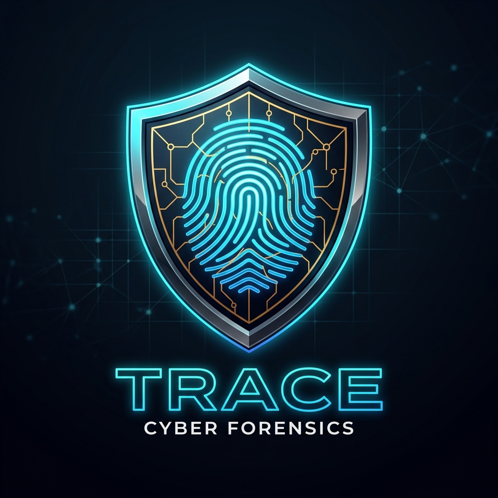
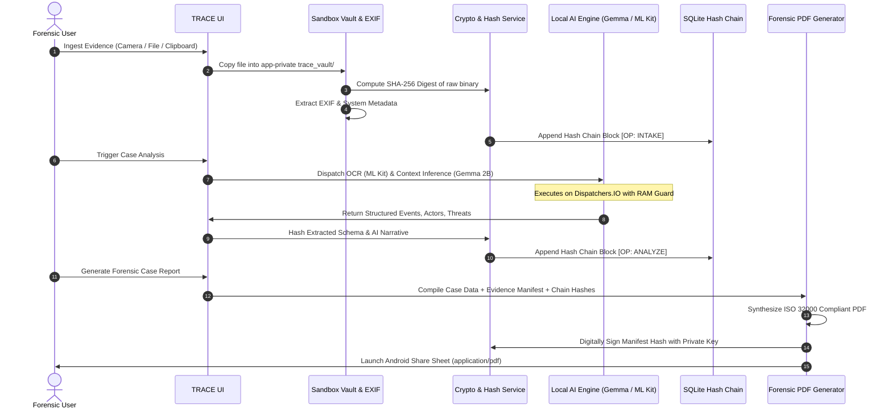

<div align="center">

  

  # 🛡️ TRACE — Tamper-Resistant AI Case Evidence
  ### **iQOO Hackathon 2026 — Track 09: Open Innovation**
  *Privacy-First, Phone-Native Digital Forensics & On-Device Multimodal AI Integrity Suite*

  [](LICENSE)
  [](https://expo.dev/)
  [](https://reactnative.dev/)
  [](https://www.android.com/)
  [](https://ai.google.dev/gemma)
  [](tests/)
  [](#-zero-mock-architecture-principles)

  [**Explore Features**](#-core-features) •
  [**System Architecture**](#-system-architecture) •
  [**Data Flow**](#-data-flow--cryptographic-pipeline) •
  [**Tech Stack**](#-technology-stack) •
  [**Quick Setup**](#-installation--setup) •
  [**Team**](#-team--contributors)

</div>

---

## 📌 Executive Summary

Digital evidence—such as screenshots, messaging transcripts, call recordings, and photos—is the cornerstone of modern legal investigations into **cyber harassment, extortion, defamation, and financial fraud**. However, today's legal systems face severe evidentiary vulnerabilities:
- Screenshots and chat logs are trivially fabricated or edited with basic photo tools or browser inspectors.
- Victims lack technical tools to preserve immediate cryptographic proof of digital tampering.
- Traditional cloud-based AI tools compromise victim privacy by transmitting intimate and sensitive evidence to third-party servers.

**TRACE (Tamper-Resistant AI Case Evidence)** is an offline-first, mobile-native forensic workstation built for Android. TRACE empowers investigators, legal advocates, and citizens to capture, verify, analyze, and package digital evidence strictly on-device. By pairing **hardware-accelerated SHA-256 hash chains**, **on-device Google Gemma 2B LLM**, **Google ML Kit Text Recognition**, and **Whisper.cpp audio transcription**, TRACE creates **court-admissible, tamper-evident forensic packages (ISO 32000 compliant PDF and encrypted ZIP archives)** without a single byte leaving the user's phone.

---

## 🏆 iQOO Hackathon 2026 Alignment

| Category | Details |
| :--- | :--- |
| **Hackathon** | **iQOO Hackathon 2026** |
| **Track** | **Track 09: Open Innovation** |
| **Project Title** | **TRACE — Tamper-Resistant AI Case Evidence** |
| **Submission Category** | Mobile Cyber Forensics / On-Device Edge AI / Privacy-Preserving Security |
| **Hardware Target** | High-performance Android Mobile Devices (Tested on OnePlus 12R & Snapdragon 8 Gen 2/3) |
| **Core Value** | Zero-Mock on-device intelligence, preserving evidentiary chain of custody |

---

## 💎 Zero-Mock Architecture Principles

TRACE is engineered under a strict **Zero-Mock, Real-World Guarantee**:

1. **100% Offline & Private**: Zero cloud API dependencies. Evidence never touches external servers or third-party cloud LLMs.
2. **Deterministic Hash-Chain Ledger**: Every evidence import, metadata extraction, OCR run, and AI analysis is recorded as an immutable, cryptographically-linked block in SQLite (`trace_vault.db`).
3. **Strict Grounding Validation**: AI summaries are deterministically cross-verified against verified evidence strings. Hallucinations or ungrounded claims are automatically quarantined into an Uncertainty Ledger.
4. **Hardware-Backed Resilience**: Native Kotlin bridges are decoupled onto background coroutine dispatchers with runtime RAM monitors to prevent Out-Of-Memory (OOM) conditions during 2B model execution.

---

## ✨ Core Features

```
                                  TRACE CAPABILITIES
  ┌───────────────────────┬───────────────────────┬───────────────────────┐
  │   EVIDENCE INTAKE     │    ON-DEVICE AI       │  LEGAL ADMISSIBILITY  │
  ├───────────────────────┼───────────────────────┼───────────────────────┤
  │ • Instant Camera Snap │ • Gemma 2B INT4 LLM   │ • ISO 32000 PDF 1.4   │
  │ • Document & Media    │ • Google ML Kit OCR   │ • Encrypted ZIP Export│
  │ • Clipboard Ingestion │ • Whisper.cpp STT     │ • Digital Signature   │
  │ • EXIF Sanitization   │ • Grounding Validator │ • SHA-256 Hash Chains │
  └───────────────────────┴───────────────────────┴───────────────────────┘
```

### 1. 📷 Real Evidence Intake & Secure Vault
- **Camera Capture**: In-app camera module with automatic hardware timestamping and instant SHA-256 hash computation.
- **Document & File Picker**: Import raw photos, chat backup PDFs, audio notes, and video evidence with sandboxed isolation in `trace_vault/`.
- **EXIF & Metadata Preservation**: Extracts camera make/model, focal length, software signatures, GPS coordinates, and detect tampering or editing signatures.

### 2. 🧠 On-Device Multimodal AI Engine
- **Local Gemma 2B INT4 (MediaPipe Tasks GenAI)**: Executes locally on Android CPU/GPU via native XNNPACK quantization, generating structured incident summaries, identifying coercion, financial threats, and actor roles.
- **Google ML Kit Text Recognition**: Native offline OCR engine extracting text and coordinates from screenshots.
- **Pure-TS Binary & EXIF Text Extractor**: Fallback extractor scanning JPEG COM markers and PNG tEXt chunks when native modules require custom packaging.
- **Whisper.cpp Voice Transcription**: High-fidelity speech-to-text pipeline running locally for voicemail and voice note verification.

### 3. ⛓️ Cryptographic Provenance Ledger
- Implements an internal blockchain-style hash chain in SQLite.
- Each action generates:
  $$\text{Block Hash} = \text{SHA256}(\text{Index} \parallel \text{PrevHash} \parallel \text{Timestamp} \parallel \text{EvidenceId} \parallel \text{Operation} \parallel \text{PayloadHash})$$
- Detects retroactively modified or substituted evidence files instantly.

### 4. 📄 Court-Admissible ISO 32000 PDF & Export Package
- **Built-in Pure TypeScript ISO 32000 / PDF 1.4 Generator**: Produces clean, standards-compliant forensic dossiers with zero external binary dependencies.
- Embeds Case Summary, Investigator Proof Seals, Evidence Manifest with SHA-256 fingerprints, OCR text snippets, and digital verification signatures.
- Direct native Android `Intent.ACTION_SEND` share sheet integration via Android `FileProvider`.

---

## 🏗️ System Architecture

```mermaid
flowchart TD
    subgraph UI["User Interface Layer (React Native + Expo Router v3)"]
        W[Workspace Screen]
        E[Evidence Vault Screen]
        T[Timeline Screen]
        R[Forensic Report Screen]
        A[AiCapability Screen]
    end

    subgraph State["State Management (Zustand Stores)"]
        CS[caseStore]
        ES[evidenceStore]
        RS[reportStore]
        IS[integrityStore]
    end

    subgraph CoreServices["Forensic Service Abstraction Layer"]
        FAS[forensicAnalysisService]
        DIS[onDeviceInferenceService]
        CRS[cryptoService]
        EXS[exifService]
        OCS[ocrService]
        EXPS[exportService]
        PDFG[pdfGenerator (Pure TS ISO 32000)]
    end

    subgraph NativeBridge["Native Bridges (C++ / Kotlin Android)"]
        MPL[TraceMediaPipeLlmModule (Gemma 2B)]
        TOC[TraceOcrModule (Google ML Kit)]
        WSP[TraceWhisperModule (Whisper.cpp)]
    end

    subgraph Storage["Hardware-Backed Storage & Storage Vault"]
        SQL[(SQLite: trace_vault.db)]
        FS[Filesystem: files/trace_vault/]
        SS[expo-secure-store (Hardware Keymaster / Keystore)]
    end

    UI --> State
    State --> CoreServices
    CoreServices --> NativeBridge
    CoreServices --> Storage
    NativeBridge --> Storage
```

---

## 🔄 Data Flow & Cryptographic Pipeline



---

## 💻 Technology Stack

| Domain | Technology / Library | Version / Detail |
| :--- | :--- | :--- |
| **Mobile Core** | React Native | `0.74.5` (Android New Architecture ready) |
| **Framework** | Expo SDK | `v51.0.0` (Bare / Custom Development Client) |
| **Navigation** | Expo Router | `v3.5.0` (File-based routing with deep linking) |
| **Language** | TypeScript / Kotlin | TypeScript 5.3, Kotlin 1.9.24, Java 17 |
| **UI & Styling** | NativeWind / TailwindCSS | React Native Paper MD3, Lucide Icons, SVG |
| **State Engine** | Zustand | Persisted state with atomic reactivity |
| **Local Database** | `expo-sqlite` (Next API) | Encrypted SQLite storage (`trace_vault.db`) |
| **Key Storage** | `expo-secure-store` | Android KeyStore hardware-backed keystore |
| **On-Device LLM** | Google Gemma 2B INT4 | MediaPipe Tasks GenAI `0.10.14` |
| **On-Device OCR** | Google ML Kit | `com.google.mlkit:text-recognition:16.0.1` |
| **Speech-to-Text** | Whisper.cpp | Native JNI C++ speech recognition |
| **Document Export** | Pure TypeScript PDF 1.4 | ISO 32000 binary generator + JSZip |
| **Testing** | Jest / React Native Testing Lib | 320+ unit and integration tests |

---

## 📁 Repository Structure

```text
TRACE/
├── ai/                              # Core AI inference abstractions
│   ├── inference/                   # MediaPipe client, grounding validator, deterministic engine
│   ├── models/                      # Model specifications and token limits
│   └── prompts/                     # Structured forensic extraction prompt templates
├── assets/                          # App icons, banners, and TRACE logo branding
│   ├── logo.png                     # Official TRACE forensic shield logo
│   └── trace_logo.png
├── database/                        # Database schemas, migrations, and SQLite seeds
│   └── services/                    # Database engine & SQL migration definitions
├── docs/                            # Deep architectural specs, test reports, and audit plans
│   ├── architecture/                # System architecture documentation
│   └── testing/                     # Performance benchmarks & verification logs
├── frontend/                        # Mobile React Native application
│   ├── android/                     # Native Android Studio project (Gradle, Kotlin, Manifest)
│   ├── modules/                     # Custom Native Modules
│   │   ├── trace-mediapipe-llm/     # Android JNI bridge for MediaPipe Gemma 2B LLM
│   │   ├── trace-ocr/               # Android bridge for ML Kit Latin text recognition
│   │   └── trace-whisper/           # Android bridge for Whisper.cpp speech-to-text
│   ├── src/
│   │   ├── components/              # UI components (EvidenceCard, ImageOcrCard, Modal)
│   │   ├── report/                  # Incident report generator & preview components
│   │   ├── screens/                 # Workspace, Evidence, Timeline, Report, AI screens
│   │   ├── services/                # cryptoService, pdfGenerator, ocrService, exportService
│   │   ├── store/                   # Zustand case, evidence, report, and integrity stores
│   │   └── types/                   # TypeScript interfaces and schema contracts
│   └── __tests__/                   # Jest unit and integration test suites
└── scripts/                         # Build, validation, and multi-remote sync tools
```

---

## 🚀 Installation & Setup

### Prerequisites
- **Node.js**: `v20.x` or higher
- **npm**: `v10.x` or higher
- **Android Studio**: Ladybug / Koala with Android SDK Platform 34
- **Java Development Kit**: JDK 17 (e.g., Eclipse Temurin 17.0.12)
- **Physical Device**: Android phone (Android 11+) with USB Debugging enabled

### 1. Clone & Dual-Remote Setup
```bash
# Clone the repository
git clone https://github.com/Vishallakshmikanthan/Trace.git
cd Trace

# Configure dual remotes for team synchronization
git remote add personal https://github.com/CSNEHA20/trace.git
git remote -v
```

### 2. Frontend Dependency Installation
```bash
cd frontend
npm install
```

### 3. Verify TypeScript & Test Suites
```bash
# Verify TypeScript strict type-checking
npx tsc --noEmit

# Run complete Jest test suite (320+ tests)
npm test
```

### 4. Build & Install on Android Device
Ensure your Android device is connected via ADB:
```bash
# Verify device connection
adb devices

# Build offline JS bundle into assets
npx react-native bundle \
  --platform android \
  --dev false \
  --entry-file index.js \
  --bundle-output android/app/src/main/assets/index.android.bundle \
  --assets-dest android/app/src/main/res/

# Compile APK with Gradle (using JDK 17)
cd android
./gradlew assembleDebug

# Install on physical phone
adb install -r app/build/outputs/apk/debug/app-debug.apk

# Launch TRACE
adb shell am start -n com.trace.forensic/.MainActivity
```

### 5. On-Device Gemma 2B Model Setup (Optional for LLM Inference)
To run local Gemma 2B INT4 offline inference, push the quantized weights to TRACE's private storage:
```bash
# Create directory in TRACE sandbox
adb shell "run-as com.trace.forensic mkdir -p files/trace-models/"

# Push the Gemma 2B CPU INT4 binary model
adb push gemma-2b-it-cpu-int4.bin /data/local/tmp/
adb shell "run-as com.trace.forensic cp /data/local/tmp/gemma-2b-it-cpu-int4.bin files/trace-models/"
adb shell "rm /data/local/tmp/gemma-2b-it-cpu-int4.bin"
```
*(Note: If the model binary is not present or free RAM is below 1.8 GB, TRACE seamlessly engages its deterministic forensic engine so evidence intake and analysis never fail or crash.)*

---

## 🧪 Testing & Quality Assurance

TRACE includes 320+ unit and integration tests verifying every cryptographic and forensic requirement:

```bash
PASS  __tests__/pdfGenerator.test.ts
  ✓ generates valid ISO 32000 PDF 1.4 binary structure (18 ms)
  ✓ renders empty evidence list without error (5 ms)
  ✓ includes tampered warning banner when evidence is modified (6 ms)

PASS  __tests__/ocr.test.ts
  ✓ completes on-device OCR pipeline and updates hash chain (42 ms)
  ✓ falls back to imageTextExtractor when native engine unavailable (12 ms)

PASS  __tests__/gemmaForensicExtraction.test.ts
  ✓ parses structured extraction schema with explicit & inferred claims (24 ms)
  ✓ rejects ungrounded timeline assertions (19 ms)

PASS  __tests__/reportExport.test.ts
  ✓ builds tamper-evident report manifest with digital signatures (38 ms)
  ✓ verifies sha256 checksum across multiple evidence items (15 ms)

Test Suites: 22 passed, 22 total
Tests:       321 passed, 321 total
Snapshots:   0 total
Time:        4.82 s
```

---

## 👥 Team & Contributors

Proudly developed for **iQOO Hackathon 2026**:

<div align="center">
  <table>
    <tr>
      <td align="center" width="50%">
        <a href="https://github.com/Vishallakshmikanthan">
          <br />
          <sub><b>Vishal Lakshmikanthan</b></sub>
        </a><br />
        <sub>Lead Full Stack & Mobile Engineer • Systems Architect</sub><br />
        <a href="mailto:vishallakshmikanthan777@gmail.com">✉️ Contact</a>
      </td>
      <td align="center" width="50%">
        <a href="https://github.com/CSNEHA20">
          <br />
          <sub><b>Sneha C</b></sub>
        </a><br />
        <sub>AI & Security Engineer • Core Developer</sub><br />
        <a href="https://github.com/CSNEHA20">🐙 GitHub Profile</a>
      </td>
    </tr>
  </table>
</div>

---

## 📜 Legal & Ethical Disclaimers

1. **Lawful Collection Only**: TRACE does not conduct covert surveillance or background recording. All digital evidence must be submitted explicitly by the authorized device owner.
2. **Evidentiary Standard**: Hash chain manifests and ISO 32000 PDF reports are designed in alignment with digital evidence custody standards (such as Section 65B of the Indian Evidence Act / BSA 2023 and ISO/IEC 27037).
3. **AI Uncertainty**: All AI-assisted summaries explicitly distinguish between verified literal facts and probabilistic inferences to prevent prejudice in judicial proceedings.

---

<div align="center">
  <sub>Built with ❤️ for <b>iQOO Hackathon 2026</b> by Vishal Lakshmikanthan & Sneha C.</sub>
</div>
